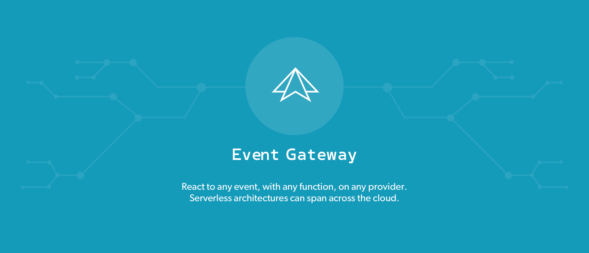

The Event Gateway combines both API Gateway and Pub/Sub functionality into a single event-driven experience. It's
dataflow for event-driven, serverless architectures. It routes Events (data) to Functions (serverless compute). Everything it cares about is an event! Even calling a function. It makes it easy to share events across different systems, teams and organizations!

Features:
- **Platform agnostic** - All your cloud services are now compatible with one another: share cross-cloud functions and events with AWS Lambda, Microsoft Azure, IBM OpenWhisk and Google Cloud Platform.
- **Send events from any cloud** - Data streams in your application become events. Centralize events from any cloud provider to get a bird’s eye view of all the data flowing through your cloud.
- **React to cross-cloud events** - You aren’t locked in to events and functions being on the same provider: Any event, on any cloud, can trigger any function. Set events and functions up like dominoes and watch them fall.
- **Expose events to your team** - Share events and functions to other parts of the application. Your teammates can find them and utilize them in their own services.
- **Extendable through middleware** - Perform data transforms, authorizations, serializations, and other custom computes straight from the Event Gateway.

The Event Gateway is a L7 proxy and realtime dataflow engine, intended for use with Functions-as-a-Service on AWS,
Azure, Google & IBM.

[](https://travis-ci.org/serverless/event-gateway)

 [Website](http://www.serverless.com) • [Newsletter](http://eepurl.com/b8dv4P) • [Gitter](https://gitter.im/serverless/serverless) • [Forum](http://forum.serverless.com) • [Meetups](https://github.com/serverless-meetups/main) • [Twitter](https://twitter.com/goserverless)


## Contents

1. [Installation](#installation)
1. [Quick Start](#quick-start)
1. [Motivation](#motivation)
1. [Components](#components)
   1. [Function Discovery](#function-discovery)
   1. [Subscriptions](#subscriptions)
1. [Events API](#events-api)
1. [Configuration API](#configuration-api)
1. [Client Libraries](#client-libraries)
1. [Comparison](#comparison)
1. [Architecture](#architecture)
   1. [System Overview](#system-overview)
   1. [Clustering](#clustering)
1. [Background](#background)

## Installation

On macOS or Linux run the following:

```
curl -sfL https://raw.githubusercontent.com/serverless/event-gateway/master/install.sh | sh
```

On Windows download [binary](https://github.com/serverless/event-gateway/releases).

## Quick Start

_Check out [`event-gateway-examples` repo](https://github.com/serverless/event-gateway-examples) for more examples._

### Running Locally

Run `event-gateway` in `dev` mode:

```
event-gateway -dev
```

### Register a Function

Register an AWS Lambda function in the Function Discovery.

```
curl --request POST \
  --url http://127.0.0.1:4001/v1/functions \
  --header 'content-type: application/json' \
  --data '{"functionId": "hello", "provider":{"type": "awslambda", "arn": "<Function AWS ARN>", "region": "<Region>", "accessKeyId": "<Access Key ID>", "secretAccessKey": "<Secret Access Key>"}}'
```

### Subscribe to an Event

Once the function is register you can subscribe it to you custom event.

```
curl --request POST \
  --url http://127.0.0.1:4001/v1/subscriptions \
  --header 'content-type: application/json' \
  --data '{"functionId": "hello", "event": "pageVisited"}'
```

### Emit an Event

An event can be emitted using [Events API](#events-api).

```
curl --request POST \
  --url http://127.0.0.1:4000/ \
  --header 'content-type: application/json' \
  --header 'event: pageVisited' \
  --data '{"userId": "123"}'
```

After emitting the event subscribed function is called asynchronously.

## Motivation

- It is cumbersome to plug things into each other. This should be easy! Why do I need to set up a queue system to
  keep track of new user registrations or failed logins?
- Introspection is terrible. There is no performant way to emit logs and metrics from a function. How do I know
  a new piece of code is actually working? How do I feed metrics to my existing monitoring system? How do I
  plug this function into to my existing analytics system?
- Using new functions is risky without the ability to incrementally deploy them.
- The AWS API Gateway is frequently cited as a performance and cost-prohibitive factor for using AWS Lambda.

## Components

### Function Discovery

Discover and call serverless functions from anything that can reach the Event Gateway. Function Discovery supports the following function types:

- FaaS functions (AWS Lambda, Google Cloud Functions, Azure Functions, OpenWhisk Actions)
- HTTP endpoints (e.g. GET http://example.com/function)

Function Discovery stores information about functions allowing the Eveng Gateway to call them as a reaction to received event.

#### Example: Register An AWS Lambda Function

##### curl example

```http
curl --request POST \
  --url http://localhost:4001/v1/functions \
  --header 'content-type: application/json' \
  --data '{
    "functionId": "hello",
    "provider":{
      "type": "awslambda",
      "arn": "arn:aws:lambda:us-east-1:377024778620:function:bluegreen-dev-helloa",
      "region": "us-east-1"
    }
}'
```

##### FDK example

```javascript
const eventGateway = fdk.eventGateway({ url: 'http://localhost' })
eventGateway.registerFunction({
  functionId: "sendEmail"
  provider: {
    type: "awslambda"
    arn: "xxx",
    region: "us-west-2",
  }
})
```

#### Example: Function-To-Function call

##### curl example

```http
curl --request POST \
  --url http://localhost:4000/ \
  --header 'content-type: application/json' \
  --header 'event: invoke' \
  --header 'function-id: createUser' \
  --data '{ "name": "Max" }'
```

##### FDK example

```javascript
const eventGateway = fdk.eventGateway({ url: 'http://localhost' })
eventGateway.invoke({
  functionId: "createUser",
  data: { name: "Max" }
})
```

### Subscriptions

Lightweight pub/sub system. Allows functions to asynchronously receive custom events. Instead of rewriting your
functions every time you want to send data to another place, this can be handled entirely in configuration
using the Event Gateway. This completely decouples functions from one another, reducing communication costs across
teams, eliminates effort spent redeploying functions, and allows you to easily share events across functions,
HTTP services, even different cloud providers. Functions may be registered as subscribers to a custom event.
When an event occurs, all subscribers are called asynchronously with the event as its argument.

#### Example: Subscribe to an Event

##### curl example

```http
curl --request POST \
  --url http://locahost:4001/v1/subscriptions \
  --header 'content-type: application/json' \
  --data '{
    "functionId": "sendEmail",
    "event": "user.created"
  }'
```

##### FDK example

```javascript
const eventGateway = fdk.eventGateway({ url: 'http://localhost' })
eventGateway.subscribe({
  event: "user.created",
  functionId: "sendEmail"
})
```

#### Example: Emit an Event

##### curl example

```http
curl --request POST \
  --url http://localhost:4000/ \
  --header 'content-type: application/json' \
  --header 'event: user.created' \
  --data '{ "name": "Max" }'
```

##### FDK example

```javascript
const eventGateway = fdk.eventGateway({ url: 'http://localhost' })
eventGateway.emit({
  event: "user.created",
  data: { name: "Max" }
})
```

#### Sync subscriptions via HTTP event

Custom event subscriptions are asynchronous. There is a special `http` event type for creating synchronous subscriptions.
`http` event is a HTTP request received on specified path and for specified HTTP method.

#### Example: Subscribe to an "http" Event

##### curl example

```http
curl --request POST \
  --url http://locahost:4001/v1/subscriptions \
  --header 'content-type: application/json' \
  --data '{
    "functionId": "listUsers",
    "event": "http",
    "method": "GET",
    "path": "/users"
  }'
```

##### FDK example

```javascript
const eventGateway = fdk.eventGateway({ url: 'http://localhost' })
eventGateway.subscribe({
  functionId: 'listUsers',
  event: 'http',
  method: 'GET',
  path: '/users'
})
```

## Events API

The Event Gateway exposes an API for emitting events. Events API can be used for emitting custom event, HTTP events and
for invoking function. By default Events API runs on `:4000` port.

### Event Definition

All data that passes through the Event Gateway is formatted as an Event, based on our default Event schema:

- `event` - `string` - the event name
- `id` - `string` - the event's instance universally unique ID (provided by the event gateway)
- `receivedAt` - `number` - the time (milliseconds) when the Event was received by the Event Gateway (provided by the event gateway)
- `data` - type depends on `dataType` - the event payload
- `dataType` - `string` - the mime type of `data` payload

Example:

```json
{
  "event": "myapp.user.created",
  "id": "66dfc31d-6844-42fd-b1a7-a489a49f65f3",
  "receivedAt": 1500897327098,
  "data": {"foo": "bar"},
  "dataType": "application/json"
}
```

When an event occurs, all subscribers are called with the event in above schema as its argument.

#### Event Data Type

The MIME type of the data block can be specified using the `Content-Type` header (by default it's
`application/octet-stream`). This allows the event gateway to understand how to deserialize the data block if it needs
to. In case of `application/json` type the event gateway passes JSON payload to the target functions. In any other case
the data block is base64 encoded.

### Emit a Custom Event

**Endpoint**

`POST <Events API URL>/`

**Request Headers**

- `Event` - `string` - required, event name
- `Content-Type`  - `MIME type string` - payload type

**Request**

arbitrary payload, subscribed function receives an event in above schema, where request payload is passed as `data` field

**Response**

Status code:
- `202 Accepted`

### Emit an HTTP Event

Creating HTTP subscription requires `method` and `path` properties. Those properties are used to listen for HTTP events.

**Endpoint**

`<method> <Events API URL>/<path>`

**Request**

arbitrary payload, subscribed function receives an event in above schema. `data` field has the following fields:

```
{
  ...
  "data": {
    "headers": <request headers>,
    "query": <request query params>,
    "body": <request payload>,
    "path": <request URL path>,
    "method": <request method>
  }
  ...
}
```

**Response**

Status code:
- `200 OK` with payload with function response

### Invoking a Registered Function - Sync Function Invocation

**Endpoint**

`POST <Events API URL>/`

**Request Headers**

- `Event` - `string` - `"invoke"`
- `Function-ID` - `string` - ID of a function to call

**Request**

arbitrary payload, invoked function receives an event in above schema, where request payload is passed as `data` field

**Response**

Status code:
- `200 OK` with payload with function response

## Configuration API

The Event Gateway exposes a RESTful JSON configuration API. By default Configuration API runs on `:4001` port.

### Function Discovery

#### Register Function

**Endpoint**

`POST <Configuration API URL>/v1/functions`

**Request**

JSON object:

- `functionId` - `string` - required, function name
- `provider` - `object` - required, provider specific information about a function, depends on type:
  - for AWS Lambda:
    - `type` - `string` - required, provider type: `awslambda`
    - `arn` - `string` - required, AWS ARN identifier
    - `region` - `string` - required, region name
    - `awsAccessKeyID` - `string` - optional, AWS API key ID. By default credentials from the [environment](http://docs.aws.amazon.com/sdk-for-go/v1/developer-guide/configuring-sdk.html#specifying-credentials) are used.
    - `awsSecretAccessKey` - `string` - optional, AWS API key. By default credentials from the [environment](http://docs.aws.amazon.com/sdk-for-go/v1/developer-guide/configuring-sdk.html#specifying-credentials) are used.
  - for HTTP function:
    - `type` - `string` - required, provider type: `http`
    - `url` - `string` - required, the URL of an http or https remote endpoint

**Response**

Status code:
- `200 OK` on success
- `400 Bad Request` on validation error

JSON object:
- `functionId` - `string` - function name
- `provider` - `object` - provider specific information about a function

------

#### Update Function

**Endpoint**

`PUT <Configuration API URL>/v1/functions/<function id>`

**Request**

JSON object:

- `provider` - `object` - required, provider specific information about a function, depends on type:
  - for AWS Lambda:
    - `type` - `string` - required, provider type: `awslambda`
    - `arn` - `string` - required, AWS ARN identifier
    - `region` - `string` - required, region name
    - `awsAccessKeyID` - `string` - optional, AWS API key ID
    - `awsSecretAccessKey` - `string` - optional, AWS API key
  - for HTTP function:
    - `type` - `string` - required, provider type: `http`
    - `url` - `string` - required, the URL of an http or https remote endpoint

**Response**

Status code:
- `200 OK` on success
- `400 Bad Request` on validation error
- `404 Not Found` if function doesn't exists

JSON object:
- `functionId` - `string` - function name
- `provider` - `object` - provider specific information about a function

------

#### Delete Function

Delete all types of functions. This operation fails if the function is currently in-use by a subscription.

**Endpoint**

`DELETE <Configuration API URL>/v1/functions/<function id>`

**Response**

Status code:
- `204 No Content` on success
- `404 Not Found` if function doesn't exists

------

#### Get Functions

**Endpoint**

`GET <Configuration API URL>/v1/functions`

**Response**

Status code:
- `200 OK` on success

JSON object:
- `functions` - `array` of `object` - functions:
  - `functionId` - `string` - function name
  - `provider` - `object` - provider specific information about a function

### Subscriptions

#### Create Subscription

**Endpoint**

`POST <Configuration API URL>/v1/subscriptions`

**Request**

- `event` - `string` - event name
- `functionId` - `string` - ID of function to receive events
- `method` - `string` - optionally, in case of `http` event, uppercase HTTP method that accepts requests
- `path` - `string` - optionally, in case of `http` event, path that accepts requests, it starts with "/"

**Response**

Status code:
- `200 OK` on success
- `400 Bad Request` on validation error

JSON object:
- `subscriptionId` - `string` - subscription ID
- `event` - `string` - event name
- `functionId` - ID of function
- `method` - `string` - optionally, in case of `http` event, HTTP method that accepts requests
- `path` - `string` - optionally, in case of `http` event, path that accepts requests, starts with `/`

------

#### Delete Subscription

**Endpoint**

`DELETE <Configuration API URL>/v1/subscriptions/<subscription id>`

**Response**

Status code:
- `204 No Content` on success
- `404 Not Found` if function doesn't exists

------

#### Get Subscriptions

**Endpoint**

`GET <Configuration API URL>/v1/subscriptions`

**Response**

Status code:
- `200 OK` on success

JSON object:
- `subscriptions` - `array` of `object` - subscriptions
  - `subscriptionId` - `string` - subscription ID
  - `event` - `string` - event name
  - `functionId` - ID of function
  - `method` - `string` - optionally, in case of `http` event, HTTP method that accepts requests
  - `path` - `string` - optionally, in case of `http` event, path that accepts requests

### Status

Dummy endpoint (always returning `200 OK` status code) for checking if the event gateway instance is running.

**Endpoint**

`GET <Configuration API URL>/v1/status`

## Client Libraries

- [FDK for Node.js](https://github.com/serverless/fdk)

## Comparison

### What The Event Gateway is NOT

- it's not a replacement for message queues (no message ordering, currently weak durability guarantees only)
- it's not a replacement for streaming platforms (no processing capability and consumers group)
- it's not a replacement for existing service discovery solutions from the microservices world


### Event Gateway vs FaaS Providers

The Event Gateway is NOT a FaaS platform. It integrates with existing FaaS providers (AWS Lambda, Google Cloud Functions,
Azure Functions, OpenWhisk Actions). The Event Gateway enables building large serverless architectures in a unified way
across different providers.


## Architecture

### System Overview

```
                                                    ┌──────────────┐                               
                                                    │              │                               
                                                    │    Client    │                               
                                                    │              │                               
                                                    └──────────────┘                               
                                                            ▲                                      
                                                            │                                      
                                                          Event                                    
                                                            │                                      
                                                            ▼                                      
                              ┌───────────────────────────────────────────────────────────┐        
                              │                                                           │        
                              │                   Event Gateway Cluster                   │        
                              │                                                           │        
                              └───────────────────────────────────────────────────────────┘        
                                                            ▲                                      
                                                            │                                      
                                                            │                                      
                              ┌─────────────────────────────┼─────────────────────────────┐        
                              │                             │                             │        
                              │                             │                             │        
                              ▼                             ▼                             ▼        
                      ┌───────────────┐             ┌───────────────┐             ┌───────────────┐
                      │  AWS Lambda   │             │ Google Cloud  │             │Azure Function │
                      │   Function    │             │   Function    │             │               │
                      │               │             │               │             │    Region:    │
                      │    Region:    │             │    Region:    │             │    West US    │
                      │   us-east-1   │             │  us-central1  │             │               │
                      └───────────────┘             └───────────────┘             └───────────────┘
```

### Clustering

The Event Gateway instances use a strongly consistent, subscribable DB (initially [etcd](https://coreos.com/etcd),
with support for Consul, and Zookeeper planned) to store and broadcast configuration. The instances locally
cache configuration used to drive low-latency event routing. The instance local cache is built asynchronously based on
events from backing DB.

The Event Gateway is a horizontally scalable system. It can be scaled by adding instances to the cluster. A cluster is
a group of instances sharing the same database. A cluster can be created in one cloud region, across multiple regions,
across multiple cloud provider or even in both cloud and on-premise data centers.

The Event Gateway is a stateless service and there is no direct communication between different instances. All
configuration data is shared using backing DB. If the instance from region A needs to call a function from region B the
invocation is not routed through the instance in region 2. The instance from region A invokes the function from region 2
directly.

```
┌─────────────────────────────────────────────Event Gateway Cluster──────────────────────────────────────────────┐
│                                                                                                                │
│                                                                                                                │
│                                            Cloud Region 1───────┐                                              │
│                                            │                    │                                              │
│                                            │   ┌─────────────┐  │                                              │
│                                            │   │             │  │                                              │
│                   ┌ ─ ─ ─ ─ ─ ─ ─ ─ ─ ─ ─ ─│─ ▶│etcd cluster │◀ ┼ ─ ─ ─ ─ ─ ─ ─ ─ ─ ─ ─ ─ ─                    │
│                                            │   │             │  │                          │                   │
│                   │                        │   └─────────────┘  │                                              │
│                                            │          ▲         │                          │                   │
│                   │                        │                    │                                              │
│        Cloud Region 2───────┐              │          │         │               Cloud Regio│ 3───────┐         │
│        │          │         │              │                    │               │                    │         │
│        │          ▼         │              │          ▼         │               │          ▼         │         │
│        │  ┌───────────────┐ │              │  ┌──────────────┐  │               │  ┌──────────────┐  │         │
│        │  │               │ │              │  │              │  │               │  │              │  │         │
│        │  │ Event Gateway │ │              │  │Event Gateway │  │               │  │Event Gateway │  │         │
│        │  │   instance    │◀┼──────────┐   │  │   instance   │◀─┼──────────┐    │  │   instance   │  │         │
│        │  │               │ │          │   │  │              │  │          │    │  │              │  │         │
│        │  └───────────────┘ │          │   │  └──────────────┘  │          │    │  └──────────────┘  │         │
│        │          ▲         │          │   │          ▲         │          │    │          ▲         │         │
│        │          │         │          │   │          │         │          │    │          │         │         │
│        │          │         │          │   │          │         │          │    │          │         │         │
│        │          ▼         │          │   │          ▼         │          │    │          ▼         │         │
│        │        ┌───┐       │          │   │        ┌───┐       │          │    │        ┌───┐       │         │
│        │        │ λ ├┐      │          └───┼───────▶│ λ ├┐      │          └────┼───────▶│ λ ├┐      │         │
│        │        └┬──┘│      │              │        └┬──┘│      │               │        └┬──┘│      │         │
│        │         └───┘      │              │         └───┘      │               │         └───┘      │         │
│        └────────────────────┘              └────────────────────┘               └────────────────────┘         │
│                                                                                                                │
│                                                                                                                │
└────────────────────────────────────────────────────────────────────────────────────────────────────────────────┘
```

## Background

SOA came along with a new set of challenges. In monolithic architectures, it was simple to call a built-in library or
rarely-changing external service. In SOA it involves much more network communication which [is not reliable](https://en.wikipedia.org/wiki/Fallacies_of_distributed_computing). The main problems to solve include:

1. Where is the service deployed? How many instances are there? Which instance is the closest to me? (service discovery)
2. Requests to the service should be balanced between all service instances (load balancing)
3. If a remote service call failed I want to retry it (retries)
4. If the service instance failed I want to stop sending requests there (circuit breaking)
5. Services are written in multiple languages, I want to communicate between them using the best language for the particular task (sidecar)
6. Calling remote service should not require setting up new connection every time as it increases request time (persistent connections)

The following systems are solutions those problems:

- [Linkerd](https://linkerd.io/)
- [Istio](https://istio.io/)
- [Hystrix](https://github.com/Netflix/Hystrix/wiki) (library, not sidecar)
- [Finagle](https://twitter.github.io/finagle/) (library, not sidecar)

The main goal of those tools is to manage the inconveniences of network communication.

### Microservices Challenges & FaaS

The greatest benefit of serverless/FaaS is that it solves almost all of above problems:

1. service discovery: I don't care! I have a function name, that's all I need.
2. load balancing: I don't care! I know that there will be a function to handle my request (blue/green deployments still an issue though)
3. retries: It's highly unusual that my request will not proceed as function instances are ephemeral and failing function is immediately replaced with a new instance. If it happens I can easily send another request. In case of failure, it's easy to understand what is the cause.
4. circuit breaking: Functions are ephemeral and auto-scaled, low possibility of flooding/DoS & [cascading failures](https://landing.google.com/sre/book/chapters/addressing-cascading-failures.html).
5. sidecar: calling function is as simple as calling method from cloud provider fdk.
6. in FaaS setting up persistent connection between two functions defeats the purpose as functions instances are ephemeral.

Tools like Envoy/Linkerd solve different domain of technical problems that doesn't occur in serverless space. They have a lot of features that are unnecessary in the context of serverless computing.

### Service Discovery in FaaS = Function Discovery

Service discovery problems may be relevant to serverless architectures, especially when we have a multi-cloud setup or we want to call a serverless function from a legacy system (microservices, etc...). There is a need for some proxy that will know where the function is actually deployed and have  retry logic built-in. Mapping from function name to serverless function calling metadata is a different problem from tracking the availability of a changing number of service instances. That's why there is a room for new tools that solves **function discovery** problem rather than the service discovery problem. Those problems are fundamentally different.

## Community

- [Email Updates](http://eepurl.com/b8dv4P)
- [Serverless Forum](http://forum.serverless.com)
- [Gitter Chatroom](https://gitter.im/serverless/serverless)
- [Serverless Meetups](http://www.meetup.com/serverless/)
- [Facebook](https://www.facebook.com/serverless)
- [Twitter](https://twitter.com/goserverless)
- [Contact Us](mailto:hello@serverless.com)
